# Домашнее задание к занятию «Защита хоста»

**Студент:** Страхов Игорь

---

## Задание 1

Задание выполнено на Ubuntu 24.04.3 LTS. Установлен eCryptfs, добавлен пользователь `cryptouser`, его домашний каталог зашифрован с помощью `ecryptfs-migrate-home`.

Установка eCryptfs:

```
apt update
apt install ecryptfs-utils
```

Создан пользователь `cryptouser`, в его домашнем каталоге размещены тестовые файлы `secret.txt` и `notes.txt`. Пока каталог не зашифрован, файлы и их содержимое доступны в открытом виде:

```
ls -la /home/cryptouser
cat /home/cryptouser/secret.txt
```

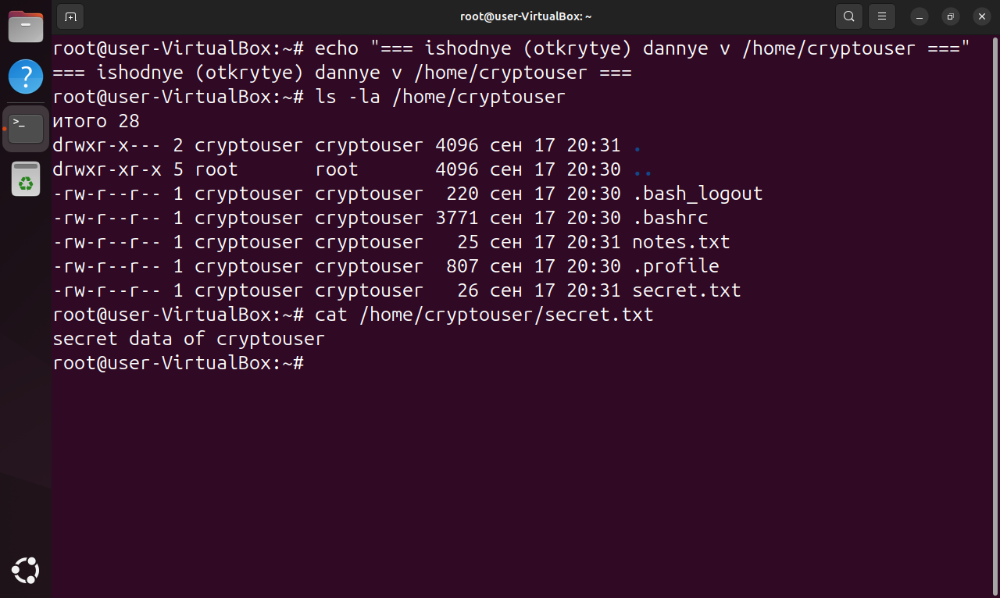

Шифрование домашнего каталога (пользователь `cryptouser` в этот момент не должен находиться в системе):

```
ecryptfs-migrate-home -u cryptouser
```

Утилита запрашивает регистрационную парольную фразу пользователя, переносит данные в зашифрованный каталог и оставляет резервную копию `/home/cryptouser.CiK5ptNx`. В конце выводится напоминание о том, что пользователь должен войти в систему до перезагрузки, чтобы завершить миграцию.

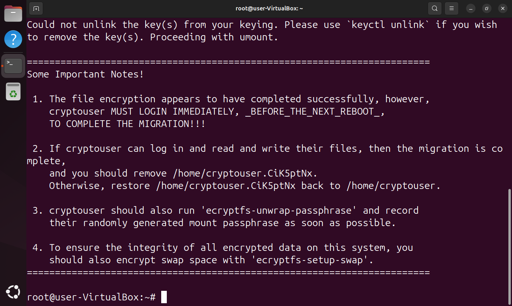

**Зашифрованные данные.** Пока каталог не смонтирован, реальные данные хранятся в `/home/.ecryptfs/cryptouser/.Private` с зашифрованными именами файлов и нечитаемым содержимым:

```
ls -la /home/.ecryptfs/cryptouser/.Private
```

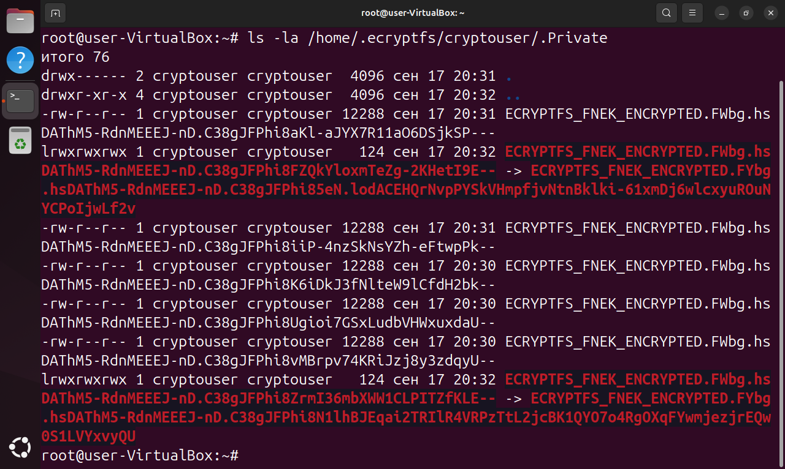

После монтирования зашифрованного каталога (`ecryptfs-mount-private` с вводом регистрационной парольной фразы) данные снова читаются в открытом виде, а `mount` показывает файловую систему типа `ecryptfs`:

```
ecryptfs-mount-private
mount | grep Private
ls -l ~
cat ~/secret.txt ~/notes.txt
```

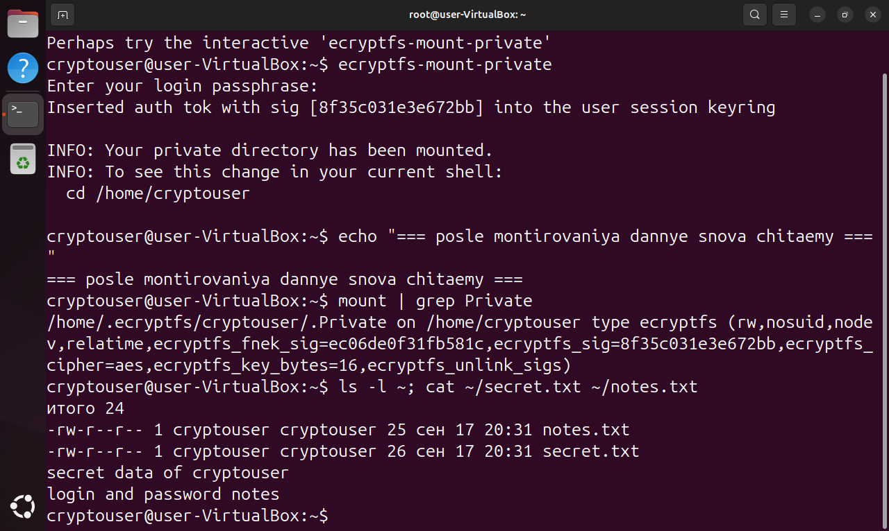

---

## Задание 2

Установлена поддержка LUKS, создан файловый раздел размером 100 Мб и зашифрован с помощью `cryptsetup`.

Установка cryptsetup:

```
apt install cryptsetup
```

Создан файл-контейнер на 100 Мб и подключён как loop-устройство `/dev/loop0`:

```
dd if=/dev/zero of=/root/luks.img bs=1M count=100
LOOP=$(losetup -fP --show /root/luks.img)
losetup -a | grep luks.img
```

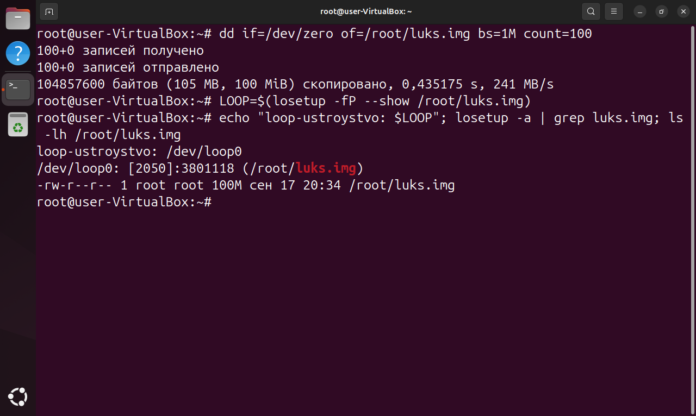

Инициализация раздела LUKS (подтверждение вводится словом `YES` заглавными буквами, затем задаётся парольная фраза):

```
cryptsetup luksFormat $LOOP
```

Проверка заголовка раздела показывает формат LUKS2, шифр `aes-xts-plain64`, длину ключа 512 бит и функцию формирования ключа `argon2id`:

```
cryptsetup isLuks $LOOP
cryptsetup luksDump $LOOP
```

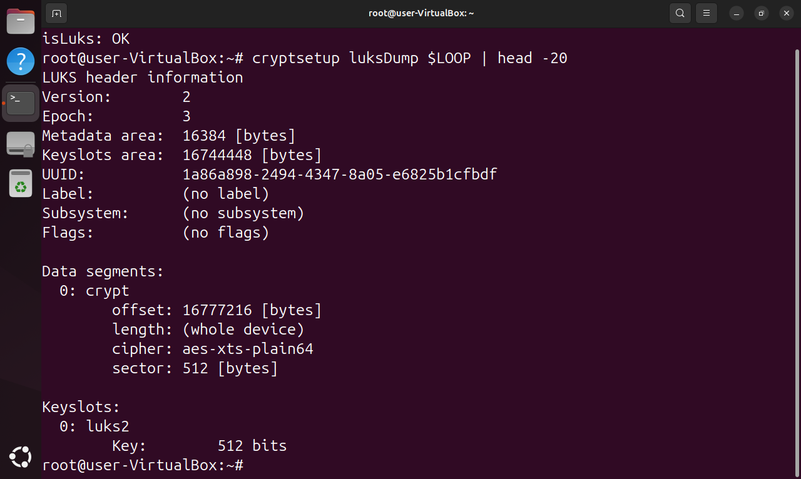

Раздел открыт под именем `secure`, на нём создана файловая система ext4, смонтирована в `/mnt/secure` и записан тестовый файл:

```
cryptsetup luksOpen $LOOP secure
mkfs.ext4 /dev/mapper/secure
mkdir -p /mnt/secure
mount /dev/mapper/secure /mnt/secure
echo "proverka shifrovaniya LUKS" > /mnt/secure/test.txt
ls -l /mnt/secure
```

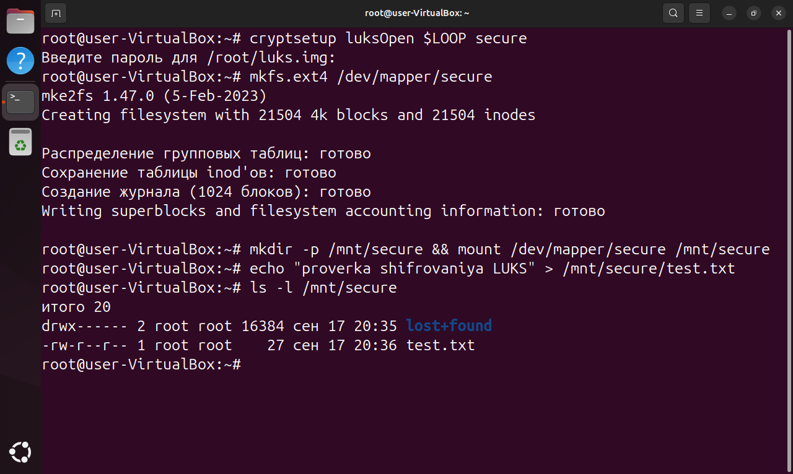

Состояние активного раздела и его закрытие. После `luksClose` устройство `/dev/mapper/secure` становится неактивным и доступ к данным без парольной фразы невозможен:

```
cryptsetup status secure
umount /mnt/secure
cryptsetup luksClose secure
cryptsetup status secure
```

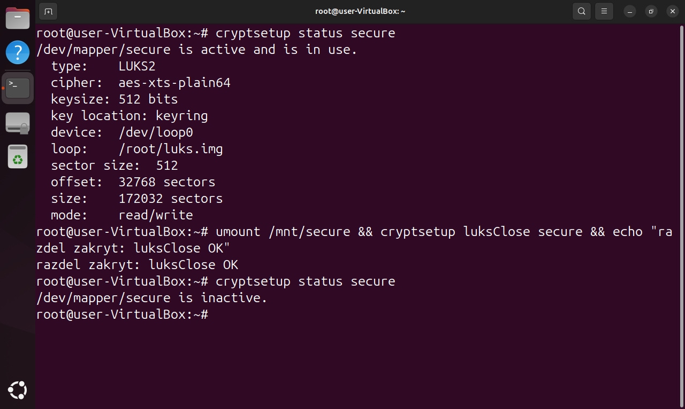

---

## Задание 3*

Установлен AppArmor, повторён эксперимент из лекции с переключением профиля между режимами `enforce` и `complain`, после чего AppArmor удалён.

Установлены утилиты управления профилями. Команда `aa-status` показывает, что модуль загружен, часть профилей работает в режиме принудительного применения:

```
apt install apparmor-utils
aa-status
```

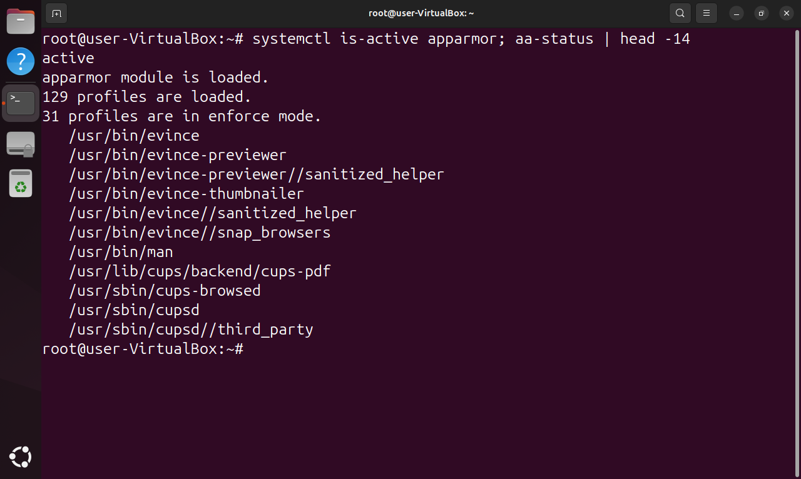

Для эксперимента создан отдельный исполняемый файл `/usr/local/bin/readfile` (копия `cat`), тестовый файл `/root/secret-file.txt` и профиль AppArmor, который разрешает запуск программы, но не разрешает ей чтение посторонних файлов:

```
cp /usr/bin/cat /usr/local/bin/readfile
echo "sekretnye dannye v zashchishchennom fayle" > /root/secret-file.txt
cat /etc/apparmor.d/usr.local.bin.readfile
```

В режиме `enforce` попытка прочитать защищённый файл блокируется, а в журнал ядра попадает запись `apparmor="DENIED"`:

```
aa-enforce /usr/local/bin/readfile
/usr/local/bin/readfile /root/secret-file.txt
dmesg | grep DENIED
```

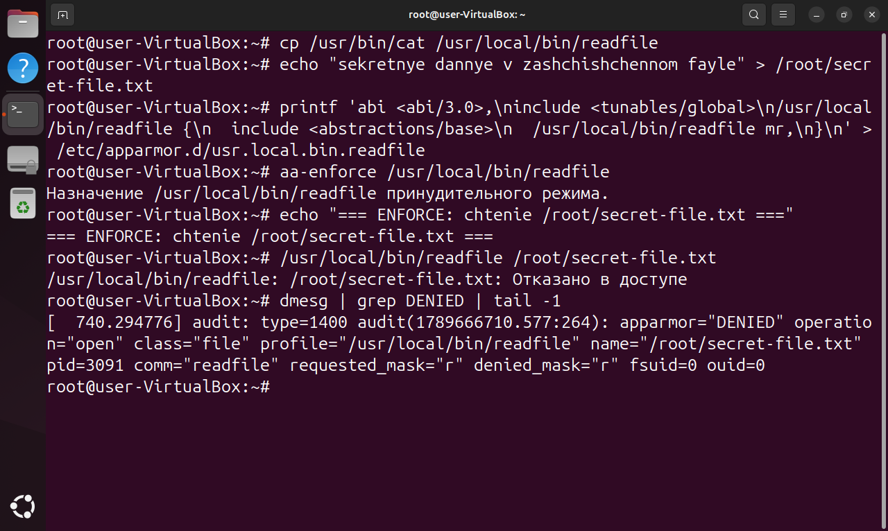

После перевода профиля в режим `complain` то же действие выполняется успешно, а нарушение только фиксируется в журнале записью `apparmor="ALLOWED"`:

```
aa-complain /usr/local/bin/readfile
/usr/local/bin/readfile /root/secret-file.txt
dmesg | grep ALLOWED
```

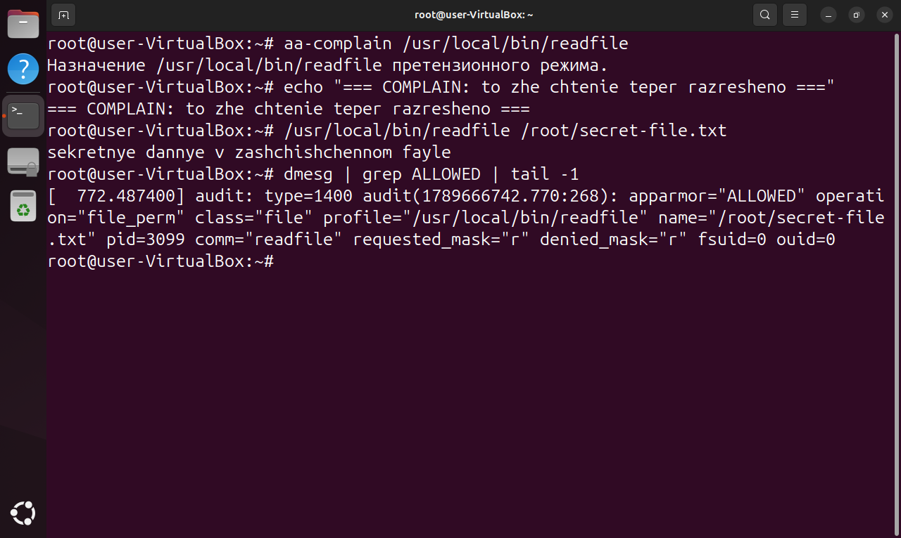

Отключение и удаление AppArmor:

```
aa-teardown
systemctl disable --now apparmor
apt purge apparmor apparmor-utils
```

После удаления утилиты `aa-status` и `apparmor_parser` в системе отсутствуют, служба `apparmor` не зарегистрирована:

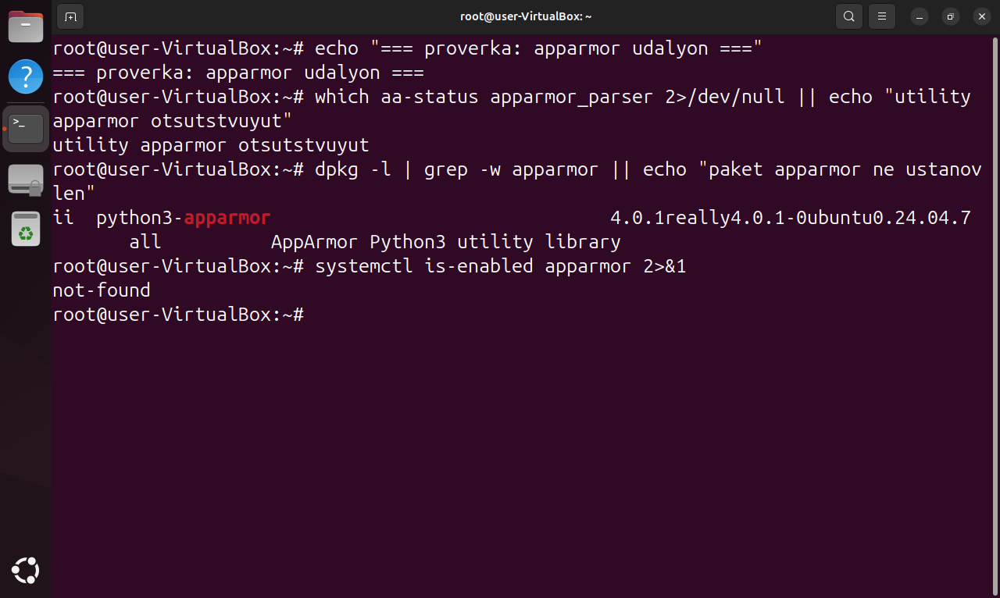
